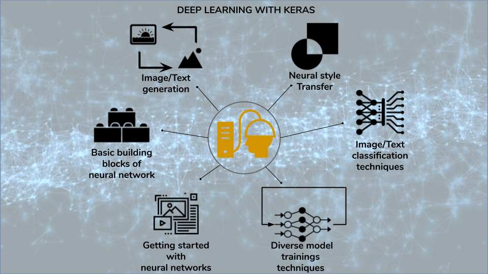

# Deep_learning_with_keras #

This repository contains versatile deep learning application implemented in keras. This could be termed as 
sheet code documentation for practical deep learning applications. As mentioned below, topics range from basic 
neural networks building blocks to complex generative models, well structured for easy understanding. 



### Verticals covered:
+ **What is deep learning?**
+ **Building blocks of neural network**
+ **Getting started with neural networks**
+ **Deep learning for computer vision**
+ **Deep learning for text and sequences**
+ **Advanced deep learning practices**
+ **Generative deep learning**

### What is available?
```
├── MNIST dataset(image) understanding, visualizing and model training
├── IMDB data(text) understanding, data encoding, visualizing and model training
├── Working with reuters dataset(text) for model training
├── Training regression model on Boston Housing Price dataset(with k-fold validation)
├── Cat & Dogs(image) classification using deep Convolution networks and data augmentation
├── Visualizing the filters in convets and effect of these filters on image data while predictions
├── Training sequentail models like RNN, LSTM(uni and bi directional), & CNN etc on text data
├── Temperature forecasting use case implemeted using GRU based model
├── Understanding keras functional API for complex models implemetation
├── Understanding tensorboad, available and custom callbacks in keras
├── Implementing variation autoencoders for image generation
├── Text generation with LSTM based language model
├── Understanding neural style transfer 
└── Implementing GANs for frog image generation
```

Note:
- All the codes are written in ipython notebook as per each topic.
- Each folder in the repo has a readme describing topics covered(in notebooks) for easy access.
- If required, link to dataset to be trained is provided in explanations.
- Sometime ipython notebook fail to render on browser due to github maintenance. 
In that case either download the notebook or wait for github to resume rendering.
 

*Author: All the code is taken from the book deep learning by python. Similar github repo of the book is available.
However, I have tried to simplify explanation of every details as per everyone's understanding.*

[](https://github.com/Sanjyot22/deep_learning_with_keras)